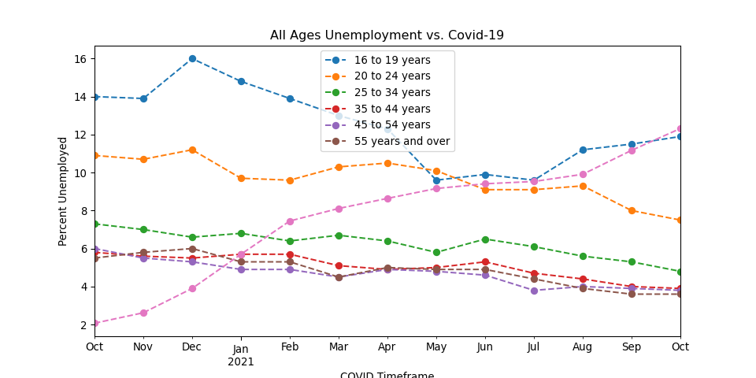
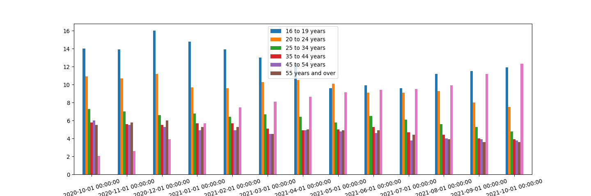
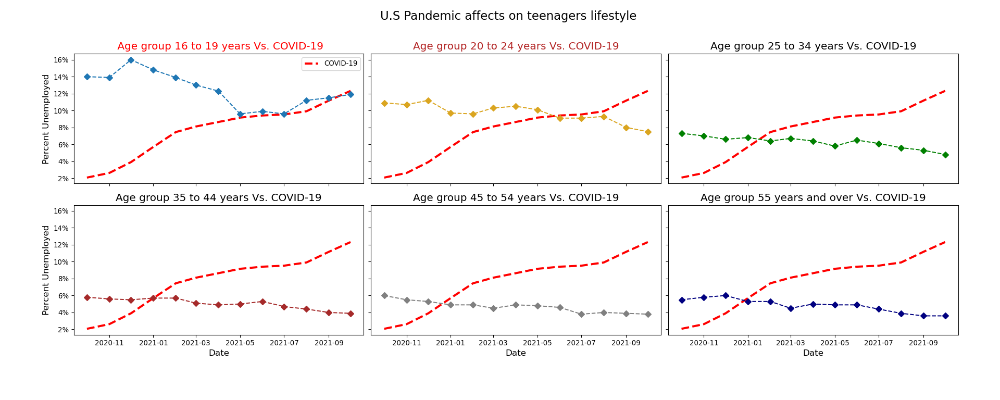

Analysis of Unemployment across US during Covid-19
================

<!-- # title: “Data Visualization Project” -->

<!-- # Author: Saumyakumar Dabhi(01218272)

# Due Date: Sunday, April 24, 2022 by 11:59pm -->

## Introduction

-   This project centers around finding and envisioning how did pandemic
    or COVID-19 affect unemployment in the United States as far as sex
    and terms of age groups.

-   This task incorporates investigating the idea of the unemployment
    rate in the United States and particularly in the State of Virginia.

-   Examining the pattern of unemployment rate in all age groups against
    the Corona virus percentage. Investigating the pattern of
    unemployment rate particularly for the age group of 16-19 between
    the year of 2018 and 2021.

## Observations

-   According to the [Bureau of US labor
    statistics](https://www.bls.gov/opub/mlr/2021/article/unemployment-rises-in-2020-as-the-country-battles-the-covid-19-pandemic.htm),
    we can observe a current downfall of employment rate rapidly due to
    the lack of jobs available.

-   In HW6, I acquired a primary dataset that contained the unemployment
    rate as well as the monthly based unemployment from the year of 2018
    to 2020 which are quarterly based.

-   In HW7, I acquired three secondary datasets. The three datasets are
    the Virginia dataset, unemployment rate based on age and gender and
    COVID-19.

-   The common attribute between the secondary datasets and the primary
    dataset is the date. I used the Virginia dataset to compare the
    unemployment rate in the nation as an average and between the first
    quarter of 2018 and the fourth quarter of 2020.

-   The result of the comparison was that the state of Virginia had a
    higher unemployment rate in the second quarter of 2020 and that was
    due to the appearance of COVID-19 in the state.

-   I used the Unemployment rate based on age and gender dataset to find
    the trend of the unemployment rate for each age group from October
    2020 to December 2021. The outcome was that the highest unemployed
    age range was between the age of 16 and 19 in December 2020 and the
    least age range was impacted by the unemployment rate which was from
    the age 55 and above.

-   In terms of gender’s visualization, I have observed that the female
    unemployment rate was higher than the male unemployment. This was
    because most women might have worked in tourism and COVID-19 had a
    major impact on tourism. In fact, travel and tourism is among the
    most affected sectors in COVID-19.

-   Moreover, I have merged the age and gender dataset with the COVID-19
    dataset to explore what happens to the COVID cases posed to the age
    groups from October 2020 till December 2021.

## Datasets

**Primary Dataset:**:

1.[Chart 2: Unemployment Rate from
2018-2021](https://fred.stlouisfed.org/series/LRUN64TTUSQ156S): This
dataset explains how the trend of unemployment rate change from the
first quarter of 2018 till the fourth quarter of 2021.

**Secondary Datasets:**:

2.[Virginia Unemployment
Rate](https://news.thecyber.live/host-https-www.bls.gov/pdq/SurveyOutputServlet?data_tool=latest_numbers&series_id=LASST510000000000003):
The dataset 50 rows and 5 columns. This dataset is based on five columns
which are Label (quarterly within each year), Series ID (Unique value),
Year, Period and Value or Virginia unemployment rate.

3.[Unemployment based on Age and
Gender](https://www.bls.gov/web/empsit/cpseea10.htm#cps_eande_m10.f.1):
This dataset consists 42 rows and 16 columns. The dataset divides the
population into subsets based on age and gender. There are three main
subsets: total, men, and women. Each subset has 11 different subsets
based on age, from 16 up to 55+.This dataset shows percentages of
unemployment specific to each of these subsets.

4.[COVID-19
Dataset](https://github.com/nytimes/covid-19-data/blob/master/us.csv):
This dataset is being gathered from the NYTimes. This dat\*aset contains
updated CoronaVirus cases and deaths.

## Final Question - HW 7

-   The question that I had further analyzed, visualized and refined the
    chart is as the following: -At what age group did COVID-19 affect
    unemployment status the most?

## Principles of Visualization

-   Before addressing the draft and refined charts, I wanted to briefly
    explain the four principles of visualization this is according to
    the Visualization Analysis and Design Book, Chapter 5.

1.  **Principle of Effectiveness**: Encodes the significant
    characteristics with the best channels to be generally recognizable
    and afterward, decreasingly significant channels can be coordinated
    with less powerful channels.

2.  **Principle of Expressiveness**: The visual encoding should
    communicate all of, and just, the data in the dataset attributes.
    The most major articulation of this standard is that arranged
    information ought to be displayed such that our perceptual framework
    characteristically faculties as requested. Alternately, unordered
    information ought not to be displayed in a manner that perceptually
    suggests a requesting that doesn’t exist.

3.  **Principle of Discriminability**: Not being able to differentiate
    between items in a visual encoding.

4.  **Principle of Separability**: Is our ability to use this channel
    affected another one?

## Draft Chart

-   To visualize the following question which is mentioned above. I have
    used Python to plot the draft line chart which consists of

| Idiom:  | Line graph                         |
|---------|------------------------------------|
| X-Axis: | Covid TimeFrame                    |
| Y-Axis: | Percentage of Unemployment         |
| Lines:  | Age Groups and COVID-19 Percentage |

**Implementation:**

``` python
import pandas as pd
import matplotlib.pyplot as plt

age_unemployment = pd.read_csv("ages_unemployment.csv")
age_unemployment = age_unemployment.drop('Unnamed: 0', axis=1)
age_unemployment['Date'] = pd.to_datetime(age_unemployment['Date'])
age_unemployment.plot(x="Date", figsize=(10,5), linestyle='--', marker='o', title="All Ages Unemployment vs. Covid-19",xlabel="COVID Timeframe", ylabel="Percent Unemployed")

plt.legend(loc='upper right', bbox_to_anchor=(-0.1,-0.2), fancybox=True,shadow=True,ncol=7)
plt.legend(['16 to 19 years', '20 to 24 years', '25 to 34 years','35 to 44 years','45 to 54 years','55 years and over'])
plt.show()
```

<!-- -->

-   I have used the pandas and matplotlib libraries to plot the line
    chart. At first, I have merged the unemployment rate based on age
    and gender.

-   Furthermore, I converted the dataframe to a csv file and read it
    here using the `read_csv()` function. I Converted the Date column to
    a datetime data type using the `pd.to_datetime()`. I used the
    matplotlib library to plot the line chart to adjust the figure size,
    change to line style type, adding title, x-axis label, y-axis label
    to the line chart, and adding a legend.

-   Based on the principles of visualization, I have went against the
    principle of separability due to having multiple lines representing
    age groups against the trend of COVID-19 which might confuse the
    audience. Due to that, I have refined the chart. So, let’s see how
    did I refine the draft chart.

## Refined Chart

-   The pre-refined chart that I thought was the bar chart, which I have
    implemented through Python.

``` python
age_unemployment.plot(x="Date", kind='bar', figsize=(15,5))
plt.legend(loc='upper left', bbox_to_anchor=(-0.1,-0.5), fancybox=True,shadow=True,ncol=7)
plt.legend(['16 to 19 years', '20 to 24 years', '25 to 34 years','35 to 44 years','45 to 54 years','55 years and over'])
plt.xticks(rotation=15)
```

    ## (array([ 0,  1,  2,  3,  4,  5,  6,  7,  8,  9, 10, 11, 12]), [Text(0, 0, '2020-10-01 00:00:00'), Text(1, 0, '2020-11-01 00:00:00'), Text(2, 0, '2020-12-01 00:00:00'), Text(3, 0, '2021-01-01 00:00:00'), Text(4, 0, '2021-02-01 00:00:00'), Text(5, 0, '2021-03-01 00:00:00'), Text(6, 0, '2021-04-01 00:00:00'), Text(7, 0, '2021-05-01 00:00:00'), Text(8, 0, '2021-06-01 00:00:00'), Text(9, 0, '2021-07-01 00:00:00'), Text(10, 0, '2021-08-01 00:00:00'), Text(11, 0, '2021-09-01 00:00:00'), Text(12, 0, '2021-10-01 00:00:00')])

``` python
plt.show()
```

<!-- -->

-   I have not chose this chart because it goes against the principle of
    effectiveness. The audience will not understand the correlation
    between COVID-19 and the age groups. Therefore, to comply with all
    the principles I have decided to create a small multiple line
    charts. I have chosen that to display each age group separately
    against the trend of COVID-19 to find out which age group were
    highly affected by COVID-19.

**Implementation**

``` python
import matplotlib.pyplot as plt
fig,a =  plt.subplots(2,3,figsize=(20,8), sharex=True, sharey=True)#(20,10)
#fig,c =  plt.subplots(1,1,figsize=(16.5,4))#(20,10)
import numpy as np

# Age group 
a[0][0].plot(age_unemployment['Date'],age_unemployment['covid_percent'],label="COVID-19",color="red",alpha=1, linestyle='dashed', linewidth=3)
a[0][0].plot(age_unemployment['Date'],age_unemployment['16 to 19 years'],linestyle='--', marker='D')
a[0][0].set_title(' Age group 16 to 19 years Vs. COVID-19',fontsize="15",color="r")
a[0][0].legend()
# a[0][0].set_xlabel("Date",fontsize="12.5")
a[0][0].set_ylabel("Percent Unemployed",fontsize="12.5")
vals = a[0][0].get_yticks()
a[0][0].set_yticklabels(['%1.0f%%' %i for i in vals])


a[0][1].plot(age_unemployment['Date'],age_unemployment['covid_percent'],label="age_unemployment['20 to 24 years']",color="r",alpha=1, linestyle='dashed', linewidth=3)
a[0][1].plot(age_unemployment['Date'],age_unemployment['20 to 24 years'],linestyle='--', marker='D',color="goldenrod")
a[0][1].set_title('Age group 20 to 24 years Vs. COVID-19',fontsize="15",color="firebrick")
# a[0][1].set_xlabel("Date",fontsize="12.5")

a[0][2].plot(age_unemployment['Date'],age_unemployment['covid_percent'],label=age_unemployment['25 to 34 years'],color="r",alpha=1, linestyle='dashed', linewidth=3)
a[0][2].plot(age_unemployment['Date'],age_unemployment['25 to 34 years'],linestyle='--', marker='D',color="Green")
a[0][2].set_title('Age group 25 to 34 years Vs. COVID-19',fontsize="15",color="black")
# a[0][2].set_xlabel("Date",fontsize="12.5")


a[1][0].plot(age_unemployment['Date'],age_unemployment['covid_percent'],label=age_unemployment['35 to 44 years'],color="r",alpha=1, linestyle='dashed', linewidth=3)
a[1][0].plot(age_unemployment['Date'],age_unemployment['35 to 44 years'],linestyle='--', marker='D',color="brown")
a[1][0].set_title('Age group 35 to 44 years Vs. COVID-19',fontsize="15",color="black")
a[1][0].set_xlabel("Date",fontsize="12.5")
a[1][0].set_ylabel("Percent Unemployed",fontsize="12.5")

a[1][1].plot(age_unemployment['Date'],age_unemployment['covid_percent'],label=age_unemployment['45 to 54 years'],color="r",alpha=1, linestyle='dashed', linewidth=3)
a[1][1].plot(age_unemployment['Date'],age_unemployment['45 to 54 years'],linestyle='--', marker='D',color="gray")
a[1][1].set_title('Age group 45 to 54 years Vs. COVID-19',fontsize="15",color="black")
a[1][1].set_xlabel("Date",fontsize="12.5")

a[1][2].plot(age_unemployment['Date'],age_unemployment['covid_percent'],label=age_unemployment['55 years and over'],color="r",alpha=1, linestyle='dashed', linewidth=3)
a[1][2].plot(age_unemployment['Date'],age_unemployment['55 years and over'],linestyle='--', marker='D',color="navy")
a[1][2].set_title('Age group 55 years and over Vs. COVID-19',fontsize="15",color="black")
a[1][2].set_xlabel("Date",fontsize="12.5")

fig.text(0.38, 0.95, "U.S Pandemic affects on teenagers lifestyle",color="black", fontsize=17)

plt.tight_layout(pad=6, w_pad=0.7, h_pad=1.0)
plt.show()
```

<!-- -->

-   The first adjustment that I have made while creating the small
    multiple line chart is to have the subplots from the highest age
    group value to the lowest age group value to figure out which of the
    age groups were really impacted by the effect of COVID-19.

-   Just by looking at the chart above, we can easily justify that youth
    unemployment rate (16-19) is the highest impacted category in
    COVID-19.

-   The second change that I have carried out is adding a caption to
    each subplot to give a concise thought of the subplot.

-   The third improvement that I have done is shading the subtitle for
    each subplot. For example, I have denoted the two most highest
    values. The most highest value had the red tone to communicate the
    significant effect for that particular age group and the second most
    highest value had the light red to communicate the second-most
    noteworthy significant effect on that particular age group and the
    other subplots will be denoted as black color.

-   The fourth refinement I have justified is the line color and shape.
    For instance, I have changed the line color for the age group
    between 25 to 34 due to the fact that it had a darker color did not
    match with the other colors. Furthermore, I have changed the color
    for COVID-19 to red because the cases as being increasing throughout
    the time. In addition to, I have increased the line width for
    COVID-19 to be different from the age group line style.

-   The fifth customization I have applied is having different font
    sizes for both labels, captions ,and the main title. For instance,
    for the caption I have made the font size for it to be 15 so it can
    be easily read by the audience and able to differentiate between the
    caption and the headline. On the other hand, I have made the
    headline for all subplots to have font size of 17 because the first
    thing the user looks at is the headline. So, if the headline is not
    visible then the user may not be able to understand the
    visualization.

-   The last tweaking that I have made to the chart is that have
    converted the y-axis label to percentage and shared the y-axis along
    the rows and shared the x-axis along the columns of the subplots.

-   People’s perceptions of data visualizations, as well as their faith
    in them, are influenced by the title. So, after analyzing the
    subplots I came to a conclusion on what to rename my title. My new
    title is Pandemic Unemployment effects on the youth. I have chosen
    this title because youth had the highest unemployment due to the
    occurrence of COVID-19.

## Conclusion

-   After analyzing and visualizing the merged dataset between the
    primary dataset and the secondary datasets. I have concluded that
    the highest age group that was really affected by this pandemic is
    the ages between 16 to 19. That is due to young people losing their
    jobs in industries in which they were found in bulk, such as
    hospitality and retails, due to the presence of COVID-19 not only in
    the USA but also globally.

-   Based on the final refined chart, I have discovered that the peak
    for unemployment rate was at December 2020 due to the increase of
    COVID-19 and winter spike. After that, a slight decrease occurred in
    unemployment rate between the ages 16 to 19 that is because tourism
    companies started to open up and they started hiring teenagers. On
    the other hand, ages from 55 and above had the lowest unemployment
    rate because most companies needed seniors to continue the service
    of the company otherwise the company will go bankruptcy.

## Final Thoughts

-   To think and create the visualization, took me roughly around 4
    hours. That is due to making alternative visualizations and choosing
    the right idiom for the data.

-   It was very helpful in splitting the project into three assignments
    because it gives me the time to research, find or scrap datasets,
    and visualize the dataset. It was really good experience and I got
    to learn how to create better visualizations and I understand when
    to implement the right idiom.

## References

1.  Tourism in
    COVID-19.https://www.unwto.org/international-tourism-and-covid-19

2.  Adding a headline to the subplots.
    <https://stackoverflow.com/questions/9350171/figure-title-with-several-colors-in-matplotlib>

3.  <https://matplotlib.org/stable/tutorials/intermediate/tight_layout_guide.html>

4.  <https://www.shanelynn.ie/bar-plots-in-python-using-pandas-dataframes/>

5.  <https://www.marsja.se/how-to-make-column-index-in-pandas-dataframe-with-examples/#>:\~:text=To%20create%20an%20index%2C%20from,modified%20dataframe%20as%20a%20result.

6.  <https://stackoverflow.com/questions/59938505/rotate-matplotlib-x-axis-on-dual-axis-plot>

7.  Importance of a title in a visualization.
    <https://medium.com/multiple-views-visualization-research-explained/a-picture-may-be-worth-a-thousand-words-but-words-frame-a-picture-78d4eee1409e#>:\~:text=When%20people%20look%20at%20a,time%20looking%20at%20the%20title.&text=In%20the%20following%20visualization%2C%20the,data%20present%20in%20the%20visualization.

8.  Teen workers getting by COVID
    <https://www.epi.org/publication/young-workers-covid-recession/#>

9.  Gender Unemployment and COVID-19,
    <https://unctad.org/news/gender-and-unemployment-lessons-covid-19-pandemic>

10. Generation Lockdown for Youth,
    <https://www.bloomberg.com/news/features/2021-11-11/where-has-unemployment-risen-6-young-workers-reveal-global-struggles>
